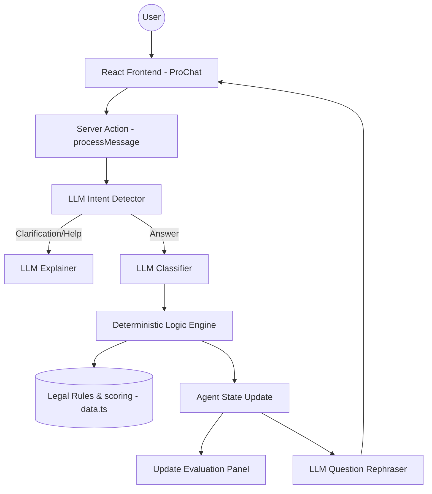

# Oneasy Legal Entity Suggestor - Architecture & Tech Stack

This document outlines the technical architecture, core components, and logic behind the Oneasy Agentic Chat application.

## 🚀 Tech Stack

- **Framework**: [Next.js 15](https://nextjs.org/) (App Router, Turbopack)
- **Language**: [TypeScript](https://www.typescript.org/)
- **AI/LLM**: [Groq Cloud SDK](https://groq.com/) (Model: `llama-3.3-70b-versatile`)
- **Styling**: [Tailwind CSS](https://tailwindcss.com/)
- **Animations**: [Framer Motion](https://www.framer.com/motion/)
- **Icons**: [Lucide React](https://lucide.dev/)

---

## 🏗️ System Architecture

Oneasy uses a **Hybrid Agentic Architecture**, combining a deterministic logic engine with LLM-powered natural language understanding.



---

## 🧠 Core Components

### 1. The Logic Engine (`src/lib/legal-agent/engine.ts`)
The "brain" of the agent. It manages the state machine:
- **Scoring**: Calculates scores for 9+ legal entities based on user answers.
- **State Selection**: Determines the next question in the decision tree.
- **Hard Gating**: Enforces legal mandates (e.g., Fintech startups **must** be Private Limited).
- **Recommendation**: Selects the top entity and calculates confidence scores.

### 2. The Knowledge Base (`src/lib/legal-agent/data.ts`)
Defines the structured decision tree:
- **Questions**: 12+ Business questions and 6+ Charity questions.
- **Impacts**: Numeric weights (scores) for each option's effect on entity recommendations.
- **Routing**: Explicit mapping of which answer leads to which next question.

### 3. The Orchestrator (`src/app/actions.ts`)
A robust wrapper that handles conversational flow:
- **Intent Detection**: Distinguishes between an answer, a meta-request ("simplify", "why?"), and off-topic chat.
- **Smart Classification**: Uses LLM to map natural language (e.g., "just me") to specific logic IDs (e.g., `JUST_ME`).
- **Conversational UI**: Transforms dry, questionnaire-style text into friendly, human-like dialogue.
- **Meta-Response Handling**: Dynamically explains *why* a question matters or *simplifies* complex legal concepts upon request.

---

## 🖥️ UI Architecture

### Split-Screen Layout
The interface is divided into two halves to provide immediate feedback:

- **Left (Chat Hub)**:
  - **MessageList**: Handles Markdown rendering, code highlighting, and auto-scrolling.
  - **ChatInput**: Minimalist, high-performance input.
  - **Dynamic Suggestions**: "Smart" chips that appear only when relevant (e.g., at the start).

- **Right (AI Evaluation Panel)**:
  - **Live Leaderboard**: Real-time scores for entities (Pvt Ltd, LLP, Trust, etc.) that update and re-rank with every message.
  - **Progress Tracking**: Visual feedback on how far the user is in the process.
  - **Dynamic Profile**: Shows a summary of what the AI has understood so far about the user's venture.

---

## 🛡️ Robustness & Edge Cases

- **"Undefined" Prevention**: Every routing path in `data.ts` is capped with a `COMPLETE` state or fallback logic.
- **Direct Intent Detection**: The first message logic detects if a user already stated their venture type (Business vs. Charity) and skips redundant questions.
- **Clarification Loop**: If the LLM cannot classify a message with high certainty, it asks a clarifying follow-up instead of guessing incorrectly.
- **"Why" Support**: Includes a built-in "B-Phase" intent to handle "why" questions, explaining the legal rationale behind each interaction.

---

## 📂 File Structure

```text
src/
├── app/
│   ├── actions.ts          # LLM Orchestrator & Server Actions
│   └── page.tsx           # Home Page
├── components/
│   ├── chat/
│   │   ├── pro-chat.tsx    # Split layout & Master State
│   │   ├── evaluation-panel.tsx # Live Dashboard
│   │   ├── message-list.tsx
│   │   └── chat-input.tsx
├── lib/
│   └── legal-agent/
│       ├── engine.ts       # Deterministic Logic
│       ├── data.ts         # Decision Tree & Rules
│       └── types.ts        # Shared State Interfaces
```
